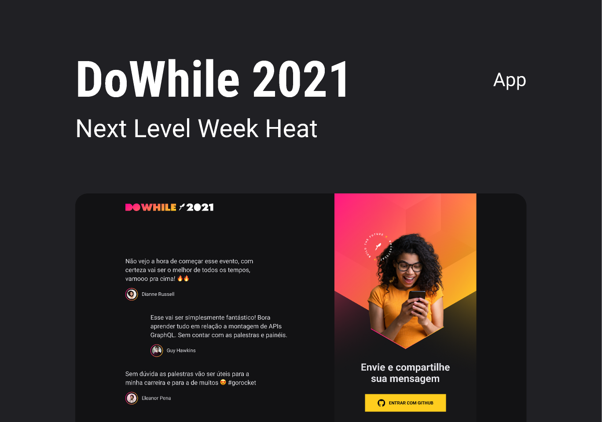

<!-- <h1 align="center">
  
</h1> -->

<!-- <p align="center">
  <a href="#-tecnologias">Tecnologias</a>&nbsp;&nbsp;&nbsp;|&nbsp;&nbsp;&nbsp;
  <a href="#-projeto">Projeto</a>&nbsp;&nbsp;&nbsp;|&nbsp;&nbsp;&nbsp;
  <a href="#-layout">Layout</a>&nbsp;&nbsp;&nbsp;|&nbsp;&nbsp;&nbsp;
  <a href="#memo-licença">Licença</a>
</p> -->

<!-- <br> -->

<p align="center">
  
</p>

## 📖 Projeto

- **Express**: framework web estruturado para configuração de ambiente provendo recursos fundamentais para aplicações web
- **Prisma**: utilizado para instaurar o SQLite na aplicação, dispensando assim a instalação de dependências de banco de dados
- **Github OAuth** - para fazer a autenticação do usuário via Github
- **Dotenv** - habilitando váriaveis ambientes (.env)
- **Axios** - para fazer requisições AJAX
- **Socket.io** - responsável por auxiliar na comunicação entre as nossas aplicações (cliente x servidor)
- **CORS** - responsável por permitir ou barrar as requisições dentro da nossa aplicação (chatoooo)

## 🧪 Tecnologias

Esse projeto foi desenvolvido com as seguintes tecnologias e bibliotecas:

- [Node](https://nodejs.org/en/)
- [Express](https://expressjs.com/)
- [Typescript](https://www.typescriptlang.org/)
- [Prisma](https://prisma.io/)
- [Axios](https://www.npmjs.com/package/axios)
- [Socket.IO](https://socket.io/)

## 🔖 Layout

Você pode visualizar o layout do projeto através [desse link](https://www.figma.com/community/file/1031699316177416916). É necessário ter conta no [Figma](https://figma.com) para acessá-lo.

## 🚀 Como executar

Clone o projeto e acesse a pasta do mesmo.

```bash
$ git clone https://github.com/d0ugui/nlw-heat.git
$ cd nlw-heat
```

Para iniciá-lo, siga os passos abaixo:

```bash
# Criação de um arquivo .env
$ Necessário setar as variáveis ambientes (Github ClientId e ClientSecret) dentro do arquivo

# Acesse para registrar uma nova aplicação e obter as chaves necessárias
$ [Github OAuth](https://github.com/settings/developers)
```

```bash
# Instalar as dependências
$ yarn or npm i

# Iniciar o projeto
$ yarn start or npm start
```

O app estará disponível no seu browser pelo endereço http://localhost:4000/

## 📝 License

Esse projeto está sob a licença MIT.
