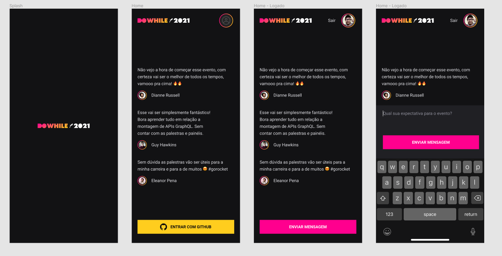

<!-- <h1 align="center">
  
</h1> -->

<!-- <p align="center">
  <a href="#-tecnologias">Tecnologias</a>&nbsp;&nbsp;&nbsp;|&nbsp;&nbsp;&nbsp;
  <a href="#-projeto">Projeto</a>&nbsp;&nbsp;&nbsp;|&nbsp;&nbsp;&nbsp;
  <a href="#-layout">Layout</a>&nbsp;&nbsp;&nbsp;|&nbsp;&nbsp;&nbsp;
  <a href="#memo-licença">Licença</a>
</p> -->

<!-- <br> -->

<p align="center">
  
</p>

## 📖 Projeto

- **Expo** é uma ferramenta que auxilia na criação de projetos em react native, com várias bibliotecas prontas de forma nativa para uso
- **Typescript** superset javascript para tipagem da aplicação

## 🧪 Tecnologias

Esse projeto foi desenvolvido com as seguintes tecnologias e bibliotecas:

- [Expo](https://expo.dev/)
- [React Native](https://reactnative.dev/)
- [Typescript](https://www.typescriptlang.org/)

## 🔖 Layout

Você pode visualizar o layout do projeto através [desse link](https://www.figma.com/community/file/1031699316177416916). É necessário ter conta no [Figma](https://figma.com) para acessá-lo.

## 🚀 Como executar

Clone o projeto e acesse a pasta do mesmo.

```bash
$ git clone https://github.com/d0ugui/nlw-heat.git
$ cd nlw-heat
$ cd mobile
```

Para iniciá-lo, siga os passos abaixo:

```bash
# Instalar as dependências
$ expo

# Iniciar o projeto
$ expo start
```

## 📝 License

Esse projeto está sob a licença MIT.
